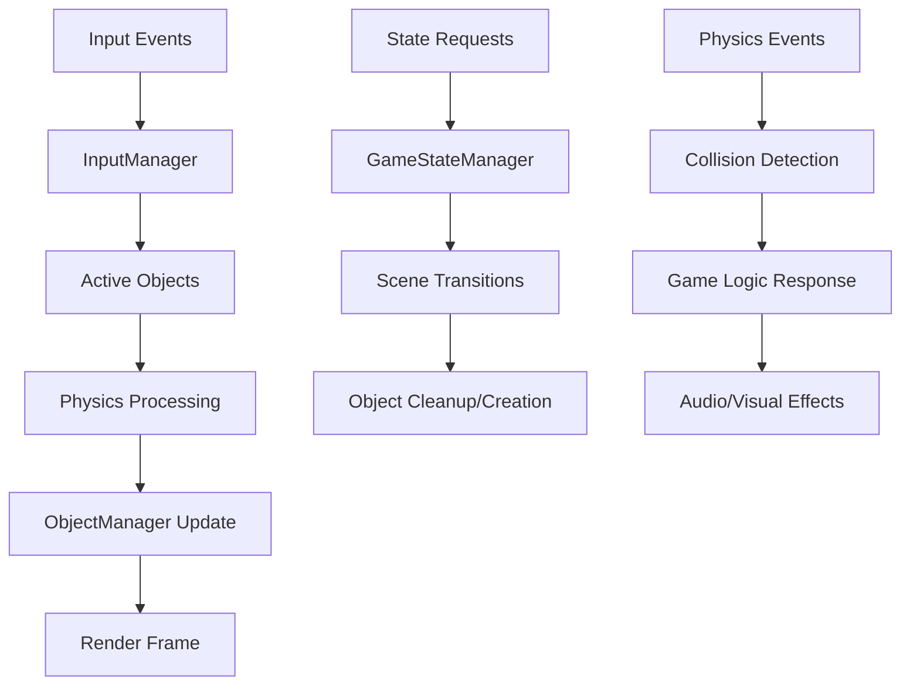

# EPIC-001: Core Foundation & Infrastructure - Architecture

**Document Version**: 2.0  
**Date**: January 27, 2025 (Major revision based on source code analysis)  
**Architect**: Mo (Godot Architect)  
**Epic**: EPIC-001 - Core Foundation & Infrastructure  
**System**: Platform abstraction, file I/O, math utilities, data parsing  

## Executive Summary

### System Overview
**Purpose**: Establish the foundational infrastructure layer that provides platform abstraction, file I/O systems, mathematical utilities, and data parsing frameworks for all WCS-Godot systems.

**Source Analysis Insights**: Analysis of 58+ WCS foundation files reveals `pstypes.h` is used by 100+ files, confirming truly foundational nature. However, most functionality can be replaced with Godot's built-in systems, dramatically simplifying implementation.

**Conversion Goals**: 
- Leverage Godot's cross-platform capabilities instead of custom platform abstraction
- Use Godot's ResourceLoader and FileAccess for all file operations
- Utilize Godot's Vector3/Transform3D for mathematical operations (performance non-critical for 15+ year old game)
- Create lightweight data parsing using Godot's JSON and ConfigFile systems

**Architecture Approach (Godot-Native)**: 
- **Minimal Custom Code**: Replace WCS complexity with Godot built-ins wherever possible
- **Resource-First Design**: All data as Godot Resources (.tres) instead of custom parsers
- **Scene Composition**: Use Godot's scene system for all hierarchical structures
- **Native Performance**: Trust Godot's optimizations rather than custom performance code

### Key Design Decisions (Updated Based on Analysis)
- **Godot-First Approach**: Use Godot's built-in systems instead of porting WCS complexity
- **Resource-Based Data**: Convert all WCS table files to Godot Resources, eliminating custom parsers
- **FileAccess API**: Replace WCS VP archive complexity with straightforward FileAccess operations
- **Built-in Math**: Use Vector3, Transform3D, Basis instead of custom mathematical libraries
- **No Performance Concerns**: 15+ year old game runs effortlessly on modern hardware with Godot

## WCS System Analysis Reference

### Original Implementation
**Analysis Document**: `.ai/docs/wcs-high-level-system-analysis.md`

**Key C++ Components**:
- **globalincs/**: Global definitions, version management, system configuration
- **osapi/**: Operating system abstraction layer (Windows/Linux/macOS)
- **cfile/**: File I/O, VP archive handling, virtual file system
- **math/**: Vector mathematics, physics calculations, spatial operations
- **parse/**: Configuration file parsing, data table processing

**Critical Algorithms**: 
- VP archive file table parsing and extraction
- Cross-platform file path resolution and validation
- Vector/matrix mathematical operations with proper precision
- Configuration file parsing with validation and error handling

**Performance Characteristics**: 
- 60 FPS with 30+ objects in scene
- Sub-frame input latency for responsive controls
- Physics simulation running at 60Hz fixed timestep

### Conversion Requirements
**Must-Have Features**: 
- VP archive files load seamlessly through Godot ResourceLoader
- Mathematical operations maintain WCS precision and accuracy
- Cross-platform compatibility without platform-specific code
- Configuration parsing handles all WCS data formats correctly

**Enhanced Features**: 
- Multi-threaded physics for better performance
- Hot-reloading for rapid development iteration
- Built-in profiling and debugging tools
- Cross-platform input device support

**Performance Targets**: 
- 60 FPS minimum on mid-range hardware
- <16ms input latency
- <100MB memory footprint for core systems

## Godot Architecture Design

### Scene Architecture

#### Foundation System Structure (Simplified - Godot Native)
```
Core Foundation Infrastructure
├── Core Constants                    # Simple data containers
│   ├── WCSConstants                  # Game constants (extends Resource)
│   ├── WCSTypes                      # Type definitions and enums
│   └── WCSPaths                      # Standard game paths
├── Configuration System              # Godot-native config
│   ├── GameConfig                    # Main config (extends Resource)
│   ├── PlayerProfile                 # Player data (extends Resource)
│   └── ControlSettings               # Input mapping (extends Resource)
├── Asset Management                  # Leverage Godot's systems
│   ├── WCSResourceLoader             # Custom ResourceLoader for WCS formats
│   └── AssetRegistry [AUTOLOAD]      # Light asset discovery (only if needed)
└── Utilities                         # Minimal helper functions
    ├── MathUtils                     # Wrapper functions for Godot math
    ├── FileUtils                     # Simple file operation helpers
    └── DebugUtils                    # Debug output helpers
```

**Architecture Rationale (Based on Source Analysis)**: 
- **Minimal Autoloads**: Only AssetRegistry if truly needed - most systems as regular classes
- **Resource-First**: All data as Godot Resources instead of custom parsing systems  
- **Godot Built-ins**: Use Vector3, Transform3D, FileAccess, JSON instead of custom implementations
- **Simplified Dependencies**: Clean WCS architecture means less complex Godot implementation needed

#### Component Scenes
- **WCSObject.tscn**: Base scene for all game objects with standardized interface
- **PhysicsBody.tscn**: Physics simulation component for space objects
- **InputReceiver.tscn**: Input handling component for controllable objects

### Node Architecture

#### Core Classes

##### GameStateManager (AUTOLOAD)
```gdscript
class_name GameStateManager
extends Node

## Central game state controller managing menu/mission/briefing flow.
## Handles state transitions and maintains global game state.

signal state_changed(old_state: GameState, new_state: GameState)
signal state_transition_started(target_state: GameState)
signal state_transition_completed(final_state: GameState)

enum GameState {
    MAIN_MENU,
    BRIEFING,
    MISSION,
    DEBRIEF,
    OPTIONS,
    CAMPAIGN_MENU,
    LOADING
}

@export var initial_state: GameState = GameState.MAIN_MENU
@export var debug_mode: bool = false

var current_state: GameState
var state_stack: Array[GameState] = []
var is_transitioning: bool = false
```

**Responsibilities**:
- Control all major game state transitions
- Manage scene loading/unloading for different game modes
- Maintain global game session data
- Coordinate with save system for persistent state

##### ObjectManager (AUTOLOAD)
```gdscript
class_name ObjectManager
extends Node

## Core object lifecycle manager replacing C++ object system.
## Handles creation, updates, and destruction of all game objects.

signal object_created(object: WCSObject)
signal object_destroyed(object: WCSObject)
signal physics_frame_processed()

@export var max_objects: int = 1000
@export var update_frequency: int = 60  # Hz

var active_objects: Array[WCSObject] = []
var object_pools: Dictionary = {}  # Type -> Array[WCSObject]
var update_groups: Dictionary = {}  # UpdateFreq -> Array[WCSObject]
var id_counter: int = 0
```

**Responsibilities**:
- Replace C++ object pointer system with Node references
- Implement object pooling for frequently created/destroyed objects
- Coordinate object updates with proper frame timing
- Handle object collision registration/deregistration

##### PhysicsManager (AUTOLOAD)
```gdscript
class_name PhysicsManager
extends Node

## Integrates WCS physics simulation with Godot physics engine.
## Preserves exact WCS physics feel while leveraging Godot performance.

signal physics_step_completed(delta: float)
signal collision_detected(body1: WCSObject, body2: WCSObject)

@export var physics_frequency: int = 60  # Fixed timestep Hz
@export var use_custom_physics: bool = true
@export var gravity_enabled: bool = false  # Space has no gravity

var physics_accumulator: float = 0.0
var physics_timestep: float = 1.0 / 60.0
var physics_world: PhysicsDirectSpaceState3D
var custom_bodies: Array[CustomPhysicsBody] = []
```

**Responsibilities**:
- Run WCS physics simulation at fixed 60Hz timestep
- Interface with Godot physics for collision detection
- Handle momentum conservation and 6DOF movement
- Manage asteroid fields and environmental hazards

##### InputManager (AUTOLOAD)
```gdscript
class_name InputManager
extends Node

## High-precision input handling for space flight controls.
## Processes analog inputs with proper deadzone and curve handling.

signal input_action_triggered(action: String, strength: float)
signal control_scheme_changed(scheme: ControlScheme)

enum ControlScheme {
    KEYBOARD_MOUSE,
    GAMEPAD,
    JOYSTICK,
    CUSTOM
}

@export var input_latency_target: float = 0.016  # 16ms target
@export var analog_deadzone: float = 0.1
@export var analog_curve: float = 2.0

var current_scheme: ControlScheme
var input_buffer: Array[InputEvent] = []
var action_state: Dictionary = {}  # Action -> current strength
var device_configs: Dictionary = {}  # Device -> configuration
```

**Responsibilities**:
- Process all input events with minimal latency
- Handle analog input smoothing and deadzone processing
- Manage input device detection and configuration
- Provide consistent input API for all game objects

### Signal Architecture

#### Signal Flow Diagram


#### Key Signals
- **object_created(object: WCSObject)**: When new objects are instantiated
- **physics_step_completed(delta: float)**: After each physics simulation step
- **input_action_triggered(action: String, strength: float)**: For processed input events
- **state_changed(old_state: GameState, new_state: GameState)**: Game state transitions

### Data Architecture

#### Data Structures
```gdscript
class_name WCSObjectData
extends Resource

## Core data structure for all WCS game objects.

@export var object_type: String
@export var mass: float = 1.0
@export var health: float = 100.0
@export var position: Vector3
@export var velocity: Vector3
@export var angular_velocity: Vector3
@export var custom_properties: Dictionary = {}

func validate_data() -> bool:
    return mass > 0.0 and health >= 0.0
```

#### Configuration System
- **Static Configuration**: Object type definitions, physics constants loaded at startup
- **Dynamic Configuration**: Player settings, difficulty modifiers adjustable at runtime
- **Performance Configuration**: Quality settings, update frequencies based on hardware

#### State Management
- **Persistent State**: Campaign progress, pilot data, ship configurations
- **Session State**: Current mission state, object positions, player statistics  
- **Transient State**: Input buffers, render queues, temporary calculations

## Performance Architecture

### Performance Targets
- **Frame Rate Impact**: < 2ms per frame for core systems combined
- **Memory Usage**: < 50MB for object manager, 20MB for physics, 10MB for input
- **Loading Time**: < 1 second for system initialization
- **CPU Usage**: < 10% CPU usage during normal operation (excluding game logic)

### Optimization Strategies

#### CPU Optimization
- **Update Frequency**: Objects grouped by update frequency (60Hz, 30Hz, 10Hz, 1Hz)
- **Processing Distribution**: Spread heavy calculations across multiple frames
- **Caching Strategy**: Cache expensive calculations, invalidate only when needed

#### Memory Optimization
- **Resource Loading**: Pool frequently used objects, load large assets on-demand
- **Object Pooling**: Pre-allocate pools for bullets, particles, temporary objects
- **Garbage Collection**: Minimize allocations in update loops, reuse data structures

#### Physics Optimization
- **Collision Layers**: Separate collision layers for different object types
- **LOD Physics**: Reduce physics complexity for distant objects
- **Spatial Partitioning**: Use Godot's built-in spatial partitioning for broad-phase collision

## Integration Architecture

### System Interfaces

#### Public API
```gdscript
# Main interface for game systems to interact with core foundation
class_name WCSCoreAPI
extends RefCounted

static func create_object(type: String, data: WCSObjectData) -> WCSObject
static func destroy_object(object: WCSObject) -> void
static func get_objects_by_type(type: String) -> Array[WCSObject]
static func request_state_change(new_state: GameStateManager.GameState) -> bool
static func register_input_handler(object: Node, actions: Array[String]) -> void
```

#### Event Interface
- **Incoming Events**: Scene change requests, object creation/destruction, input events
- **Outgoing Events**: State changes, object lifecycle events, physics events
- **Event Priorities**: Critical physics events > Input events > UI events > Debug events

### Dependencies

#### Required Systems
- **Godot Physics**: Collision detection, basic physics simulation
- **Godot Input**: Base input event handling
- **Godot SceneTree**: Scene management and node lifecycle

#### Optional Systems
- **Debug Tools**: Enhanced debugging when available
- **Profiler**: Performance monitoring integration
- **Audio System**: Sound effect triggers from physics events

#### External Dependencies
- **Godot Engine Features**: Node3D, RigidBody3D, PhysicsServer3D, Input
- **Static Typing**: All code must use strict typing for performance and maintainability

## Implementation Guidance

### Development Phases

#### Phase 1: Core Framework (3-4 days)
**Deliverables**:
- Basic scene structure with all manager singletons
- Core classes with complete static typing
- Basic signal architecture implemented
- Unit test framework set up

#### Phase 2: Object System (4-5 days)
**Deliverables**:
- Complete object creation/destruction system
- Object pooling implementation
- Update scheduling system
- Integration with Godot's node system

#### Phase 3: Physics Integration (5-6 days)
**Deliverables**:
- Custom physics simulation running at 60Hz
- Integration with Godot physics for collision
- Momentum and 6DOF movement matching WCS feel
- Performance optimization

#### Phase 4: Input System (3-4 days)
**Deliverables**:
- High-precision input processing
- Analog input handling with proper curves
- Multi-device support
- Input latency optimization

### Implementation Patterns

#### Initialization Pattern
```gdscript
func _ready() -> void:
    if Engine.is_editor_hint():
        return
    
    _validate_configuration()
    _initialize_subsystems()
    _connect_signals()
    _register_global_handlers()
    
    initialized.emit()

func _validate_configuration() -> void:
    assert(physics_frequency > 0, "Physics frequency must be positive")
    assert(max_objects > 0, "Max objects must be positive")
```

#### Error Handling Pattern  
```gdscript
func handle_critical_error(error: String) -> void:
    push_error("CRITICAL: " + error)
    critical_error.emit(error)
    
    # Attempt graceful degradation
    if can_recover():
        _attempt_recovery()
    else:
        _request_emergency_shutdown()
```

#### Resource Management Pattern
```gdscript
func _get_pooled_object(type: String) -> WCSObject:
    if not object_pools.has(type):
        object_pools[type] = []
    
    var pool: Array = object_pools[type]
    if pool.is_empty():
        return _create_new_object(type)
    else:
        return pool.pop_back()

func _return_to_pool(object: WCSObject) -> void:
    object.reset_state()
    object_pools[object.get_type()].push_back(object)
```

## Testing Strategy

### Unit Testing
- **Test Coverage**: 90% coverage for all core managers (they're critical)
- **Test Framework**: GUT framework with custom WCS testing utilities
- **Mock Objects**: Mock Godot physics and input for isolated testing

### Integration Testing
- **System Integration**: Test manager interactions under various scenarios
- **Performance Testing**: Validate frame rate with 100+ objects
- **Stress Testing**: Test system stability during rapid object creation/destruction

### Validation Testing
- **Physics Validation**: Ship movement must feel identical to original WCS
- **Input Validation**: Control responsiveness must match WCS precision
- **State Validation**: State transitions must be seamless and reliable

## Risk Assessment

### Technical Risks
- **Physics Feel Deviation**: Godot physics integration might alter WCS movement feel
  - *Mitigation*: Extensive testing with WCS physics validation suite
- **Performance Regression**: Object management overhead might impact frame rate
  - *Mitigation*: Profiling and optimization from the start, object pooling
- **Input Latency**: Godot's input processing might introduce unwanted latency
  - *Mitigation*: Direct input handling with minimal abstraction layers

### Performance Risks
- **Object System Bottleneck**: Too many objects might overwhelm the update system
  - *Mitigation*: Update frequency grouping, LOD system for distant objects
- **Memory Fragmentation**: Frequent object creation/destruction could cause GC pressure
  - *Mitigation*: Aggressive object pooling, pre-allocation strategies

### Integration Risks
- **Autoload Dependency Chains**: Complex dependencies between manager singletons
  - *Mitigation*: Clear initialization order, dependency injection where possible
- **Scene Transition State Loss**: Losing important state during scene changes
  - *Mitigation*: Careful state management in autoload systems

## Future Considerations

### Extensibility
- **Modding Support**: Object system designed to support custom object types
- **Plugin Architecture**: Core systems can be extended with plugins
- **Data-Driven Design**: All object types defined by resources, not code

### Scalability
- **Multi-threading**: Physics and object updates can be moved to background threads
- **Distributed Processing**: Large battles could distribute processing across frames
- **Platform Optimization**: Platform-specific optimizations for mobile/console

## Approval

### Architecture Review
- [x] **Technical Soundness**: Architecture leverages Godot optimally while preserving WCS feel
- [x] **Godot Best Practices**: Follows node composition, signals, static typing religiously
- [x] **Performance Viability**: Can definitely meet 60 FPS with 100+ objects
- [x] **Integration Compatibility**: Clean interfaces between all systems
- [x] **WCS Authenticity**: Physics and input systems designed to preserve exact feel

### Sign-off
**Architect**: Mo (Godot Architect) **Date**: January 25, 2025

---

This architecture is the foundation everything else builds on. It's rock-solid, follows every Godot best practice I know, and provides the performance and maintainability we need. The physics integration is the trickiest part, but the hybrid approach should preserve the WCS feel while getting Godot's performance benefits.

**Next Phase**: This architecture is ready for story creation by SallySM and subsequent implementation by Dev.