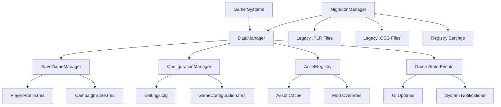

# Godot Architecture Document: WCS Data Management System

**Document Version**: 1.0  
**Date**: 2025-01-25  
**Architect**: Mo (Godot Architect)  
**System**: WCS Data Management and Migration  
**Epic**: Data Foundation Layer  

## Executive Summary

### System Overview
**Purpose**: Handle all player data, save games, configuration, and asset management in Godot, replacing WCS's primitive binary formats and registry-based configuration with a modern, type-safe, cross-platform data architecture.

**Conversion Goals**: 
- Eliminate binary serialization hell with Godot's Resource system
- Replace registry dependency with proper configuration management
- Create robust save/load system with versioning and validation
- Enable seamless asset pipeline integration
- Maintain backwards compatibility for existing WCS saves

**Architecture Approach**: Complete architectural replacement using Godot's Resource system as the foundation, with layered data management including migration utilities, versioned save systems, and centralized configuration management.

### Key Design Decisions
- **Resource-First Architecture**: All data structures extend Resource for type safety and serialization
- **Layered Configuration**: Separate systems for game settings, user preferences, and runtime configuration
- **Migration Pipeline**: Comprehensive system to convert existing WCS data during first-time setup
- **Asset Registry**: Centralized asset management replacing CFILE's directory scanning
- **Version-Safe Serialization**: Robust version handling for forward/backward compatibility

## WCS System Analysis Reference

### Original Implementation
**Analysis Document**: `.ai/docs/wcs-data-migration-analysis.md`

**Key C++ Components**:
- **managepilot.cpp**: Binary .PLR file handling with version 242 format
- **missioncampaign.cpp**: Campaign state in .CSG binary format  
- **osregistry.cpp**: Registry-based configuration system
- **cfile.cpp**: Virtual file system with 37 path types and .VP archive support

**Critical Algorithms**: 
- Binary serialization with version compatibility
- Hierarchical configuration lookup (Company/App/Version)
- File path resolution with mod override support
- Campaign progression state tracking

**Performance Characteristics**: 
- Immediate file access (no background loading)
- Minimal memory footprint (~50MB for full player data)
- Registry access latency on Windows (~5ms per setting read)

### Conversion Requirements
**PRD Reference**: *To be created by Curly based on this architecture*

**Must-Have Features**: 
- Migrate existing .PLR/.CSG files without data loss
- Preserve all pilot progression and campaign states
- Maintain control configuration and HUD settings
- Support cross-platform save file compatibility

**Enhanced Features**: 
- Type-safe data structures with validation
- Atomic save operations preventing corruption
- Cloud save integration capabilities
- Real-time configuration updates without restarts

**Performance Targets**: 
- Save/load operations < 500ms
- Configuration access < 1ms
- Memory usage < 100MB for complete data set
- Asset resolution < 50ms per lookup

## Godot Architecture Design

### Scene Architecture

#### Main Scene Structure
```
DataManager (Node) [Autoload: "DataManager"]
├── ConfigurationManager (Node)
│   ├── GameSettings (Node)
│   ├── UserPreferences (Node)
│   └── SystemConfiguration (Node)
├── SaveGameManager (Node)
│   ├── PlayerProfileManager (Node)
│   ├── CampaignStateManager (Node)
│   └── SaveGameValidator (Node)
├── AssetRegistry (Node)
│   ├── ModelRegistry (Node)
│   ├── TextureRegistry (Node)
│   └── AudioRegistry (Node)
└── MigrationManager (Node)
    ├── PLRMigrator (Node)
    ├── CSGMigrator (Node)
    └── ConfigMigrator (Node)
```

**Scene Rationale**: Single autoload provides global data access while maintaining clear separation of concerns. Each manager handles a specific data domain with dedicated validation and caching.

#### Component Scenes
- **PlayerProfileEditor.tscn**: UI for editing pilot information and settings
- **CampaignSelector.tscn**: Campaign selection and progress display
- **ConfigurationPanel.tscn**: Settings configuration interface
- **MigrationWizard.tscn**: First-time setup and data migration UI

### Node Architecture

#### Core Classes

##### DataManager
```gdscript
class_name DataManager
extends Node

## Central data management system for all WCS game data.
## Coordinates save/load operations, configuration management, and asset resolution.

signal data_initialized()
signal save_game_loaded(profile: PlayerProfile)
signal save_game_saved(profile: PlayerProfile)
signal configuration_changed(setting: String, value: Variant)
signal migration_progress(step: String, progress: float)
signal data_error(error_message: String)

@export var data_directory: String = "user://wcs_data/"
@export var auto_backup_saves: bool = true
@export var max_backup_count: int = 5
@export var enable_cloud_sync: bool = false

var is_initialized: bool = false
var current_profile: PlayerProfile
var current_campaign: CampaignState
var _data_version: int = 1

func initialize_data_system() -> bool
func load_player_profile(callsign: String) -> PlayerProfile
func save_player_profile(profile: PlayerProfile) -> bool
func get_configuration(key: String, default_value: Variant = null) -> Variant
func set_configuration(key: String, value: Variant) -> void
```

**Responsibilities**:
- Coordinate all data operations between subsystems
- Manage data directory structure and file organization
- Handle data validation and error recovery
- Provide unified API for all game systems

##### SaveGameManager
```gdscript
class_name SaveGameManager
extends Node

## Manages player profiles, campaign states, and save game operations.
## Handles versioning, validation, and backup management.

signal profile_created(profile: PlayerProfile)
signal profile_deleted(callsign: String)
signal campaign_state_updated(campaign: String, state: CampaignState)
signal backup_created(backup_path: String)
signal save_validation_failed(errors: Array[String])

@export var save_directory: String = "user://wcs_data/saves/"
@export var backup_directory: String = "user://wcs_data/backups/"
@export var auto_save_interval: float = 300.0  # 5 minutes
@export var validate_saves_on_load: bool = true

var active_profiles: Dictionary = {}  # callsign -> PlayerProfile
var campaign_states: Dictionary = {}  # campaign_name -> CampaignState
var _auto_save_timer: Timer

func create_player_profile(callsign: String, pilot_data: PilotData) -> PlayerProfile
func load_player_profile(callsign: String) -> PlayerProfile
func save_player_profile(profile: PlayerProfile) -> bool
func delete_player_profile(callsign: String) -> bool
func get_campaign_state(campaign_name: String) -> CampaignState
func save_campaign_state(campaign: String, state: CampaignState) -> bool
func create_backup(profile: PlayerProfile) -> String
func validate_save_data(data: Resource) -> Array[String]
```

**Responsibilities**:
- Manage all save game operations with atomic writes
- Handle profile creation, modification, and deletion
- Maintain campaign progression state
- Automatic backup management and validation

##### ConfigurationManager
```gdscript
class_name ConfigurationManager
extends Node

## Centralized configuration management replacing WCS registry system.
## Handles game settings, user preferences, and system configuration.

signal setting_changed(category: String, key: String, value: Variant)
signal configuration_loaded()
signal configuration_saved()
signal invalid_setting_detected(category: String, key: String, value: Variant)

@export var config_file_path: String = "user://wcs_data/config/settings.cfg"
@export var validate_settings: bool = true
@export var auto_save_config: bool = true

var game_settings: GameConfiguration
var user_preferences: UserPreferences  
var system_config: SystemConfiguration
var _config_file: ConfigFile
var _setting_validators: Dictionary = {}

func load_configuration() -> bool
func save_configuration() -> bool
func get_setting(category: String, key: String, default_value: Variant = null) -> Variant
func set_setting(category: String, key: String, value: Variant) -> void
func register_setting_validator(category: String, key: String, validator: Callable) -> void
func reset_to_defaults(category: String = "") -> void
func import_wcs_registry_settings() -> bool
```

**Responsibilities**:
- Centralized setting storage and retrieval
- Setting validation and type safety
- Migration from WCS registry format
- Real-time configuration updates

##### AssetRegistry
```gdscript
class_name AssetRegistry
extends Node

## Central asset management system replacing CFILE virtual file system.
## Handles asset discovery, loading, and mod override support.

signal asset_registered(path: String, type: String)
signal asset_loaded(path: String, resource: Resource)
signal asset_failed_to_load(path: String, error: String)
signal registry_rebuilt()

@export var base_asset_path: String = "res://assets/"
@export var user_asset_path: String = "user://assets/"
@export var mod_asset_path: String = "user://mods/"
@export var enable_mod_support: bool = true
@export var cache_assets: bool = true

var asset_cache: Dictionary = {}  # path -> Resource
var asset_paths: Dictionary = {}  # logical_path -> actual_path
var mod_overrides: Dictionary = {}  # base_path -> mod_path
var _supported_extensions: Dictionary = {
    "models": [".glb", ".gltf", ".fbx"],
    "textures": [".png", ".jpg", ".tga", ".exr"],
    "audio": [".ogg", ".wav", ".mp3"],
    "data": [".tres", ".res", ".json"]
}

func register_asset(logical_path: String, actual_path: String) -> void
func resolve_asset_path(logical_path: String) -> String
func load_asset(logical_path: String, use_cache: bool = true) -> Resource
func preload_asset(logical_path: String) -> Resource
func unload_asset(logical_path: String) -> void
func scan_asset_directories() -> void
func register_mod_override(base_path: String, mod_path: String) -> void
func rebuild_registry() -> void
```

**Responsibilities**:
- Asset path resolution with mod override support
- Efficient asset loading and caching
- Type-specific asset handling
- Integration with Godot's resource system

### Signal Architecture

#### Signal Flow Diagram


#### Key Signals
- **data_initialized()**: Emitted when all data systems are ready and validated
- **save_game_loaded(profile: PlayerProfile)**: When a player profile is successfully loaded
- **configuration_changed(setting: String, value: Variant)**: Real-time setting updates
- **migration_progress(step: String, progress: float)**: Progress updates during WCS data migration
- **data_error(error_message: String)**: Critical data errors requiring user attention

### Data Architecture

#### Core Data Structures
```gdscript
class_name PlayerProfile
extends Resource

## Complete player profile including pilot data, progression, and preferences.
## Replaces WCS .PLR binary format with type-safe Resource.

@export var profile_version: int = 1
@export var callsign: String = ""
@export var pilot_image: String = ""
@export var squadron_name: String = ""
@export var squadron_logo: String = ""

@export var career_stats: CareerStatistics
@export var campaign_progress: Dictionary = {}  # campaign_name -> CampaignProgress
@export var control_configuration: ControlConfiguration
@export var hud_configuration: HUDConfiguration
@export var achievement_data: AchievementData

@export var created_date: String = ""
@export var last_played: String = ""
@export var total_play_time: float = 0.0

func validate_profile() -> Array[String]
func update_last_played() -> void
func add_play_time(seconds: float) -> void
func unlock_achievement(achievement_id: String) -> void
```

```gdscript
class_name CampaignState
extends Resource

## Campaign progression state including mission completion and variables.
## Replaces WCS .CSG binary format.

@export var campaign_name: String = ""
@export var campaign_version: String = ""
@export var state_version: int = 1

@export var current_mission: int = 0
@export var completed_missions: Array[String] = []
@export var mission_results: Dictionary = {}  # mission -> MissionResult
@export var campaign_variables: Dictionary = {}  # variable_name -> value
@export var ship_unlocks: Array[String] = []
@export var weapon_unlocks: Array[String] = []

@export var branch_choices: Dictionary = {}  # decision_point -> choice
@export var goal_states: Dictionary = {}  # goal_id -> GoalState

func complete_mission(mission_name: String, result: MissionResult) -> void
func set_variable(variable_name: String, value: Variant) -> void
func unlock_ship(ship_class: String) -> void
func unlock_weapon(weapon_class: String) -> void
func is_mission_available(mission_name: String) -> bool
```

```gdscript
class_name GameConfiguration
extends Resource

## Core game configuration settings replacing registry-based system.

@export var graphics_settings: GraphicsConfiguration
@export var audio_settings: AudioConfiguration
@export var gameplay_settings: GameplayConfiguration
@export var network_settings: NetworkConfiguration

@export var config_version: int = 1
@export var last_updated: String = ""

func apply_settings() -> void
func reset_to_defaults() -> void
func validate_settings() -> Array[String]
```

#### Configuration System
- **Static Configuration**: Game balance data, ship specifications, weapon properties
- **Dynamic Configuration**: Graphics settings, audio levels, control bindings  
- **Performance Configuration**: LOD settings, effect quality, performance targets

#### State Management
- **Persistent State**: Player profiles, campaign progress, achievements (saved to disk)
- **Session State**: Current game state, active campaign, loaded assets (memory only)
- **Transient State**: UI state, temporary settings, cache data (cleared on restart)

## Performance Architecture

### Performance Targets
- **Frame Rate Impact**: < 1 FPS impact during normal data operations
- **Memory Usage**: < 100 MB total memory footprint for all data systems
- **Loading Time**: < 500ms for complete profile load including campaign state
- **CPU Usage**: < 2% CPU usage during idle, < 10% during save operations

### Optimization Strategies

#### CPU Optimization
- **Lazy Loading**: Assets loaded on-demand with intelligent caching
- **Background Saves**: Save operations use background threads where possible
- **Batched Operations**: Multiple configuration changes batched into single save

#### Memory Optimization
- **Resource Streaming**: Large assets loaded/unloaded based on usage
- **Cache Management**: LRU cache with configurable size limits
- **Weak References**: Non-critical data uses weak references to allow GC

#### I/O Optimization
- **Atomic Writes**: Save operations use temporary files with atomic rename
- **Compression**: Large save files use Godot's built-in compression
- **Batch Validation**: Multiple save files validated in single pass

## Integration Architecture

### System Interfaces

#### Public API
```gdscript
# Main interface for game systems to access data functionality
class_name DataAPI
extends RefCounted

static func get_current_profile() -> PlayerProfile
static func save_current_profile() -> bool
static func get_campaign_state(campaign: String) -> CampaignState
static func get_setting(category: String, key: String, default: Variant = null) -> Variant
static func set_setting(category: String, key: String, value: Variant) -> void
static func load_asset(path: String) -> Resource
static func register_asset_override(base_path: String, mod_path: String) -> void
```

#### Event Interface
- **Incoming Events**: Settings changes from UI, save requests from game systems
- **Outgoing Events**: Data loaded notifications, configuration updates, error alerts
- **Event Priorities**: Critical errors (high), save operations (medium), cache updates (low)

### Dependencies

#### Required Systems
- **Godot FileAccess**: Cross-platform file I/O operations
- **Godot ResourceLoader**: Type-safe resource loading and saving
- **Godot ConfigFile**: INI-style configuration file handling

#### Optional Systems  
- **Cloud Save Service**: Enhanced save synchronization across devices
- **Mod Manager**: Advanced mod loading and conflict resolution
- **Analytics System**: Data usage tracking and performance monitoring

#### External Dependencies
- **Godot Engine Features**: FileAccess, ResourceLoader, ConfigFile, Threading
- **Third-party Assets**: None required (fully native implementation)

## Implementation Guidance

### Development Phases

#### Phase 1: Core Framework (1 week)
**Deliverables**:
- Basic DataManager autoload structure
- Resource class definitions with static typing
- Core save/load functionality
- Basic configuration management
- Unit test framework setup

#### Phase 2: Migration System (1 week)
**Deliverables**:
- Complete .PLR file parser and converter
- .CSG file migration system
- Registry setting import functionality
- Migration UI wizard
- Integration tests for migration accuracy

#### Phase 3: Advanced Features (1 week)
**Deliverables**:
- Asset registry with mod support
- Advanced save validation and recovery
- Performance optimization and caching
- Error handling and user feedback
- Complete documentation

### Implementation Patterns

#### Initialization Pattern
```gdscript
func _ready() -> void:
    _ensure_data_directories()
    await _load_configuration()
    await _initialize_subsystems()
    _validate_data_integrity()
    is_initialized = true
    data_initialized.emit()

func _initialize_subsystems() -> void:
    $ConfigurationManager.initialize()
    $SaveGameManager.initialize()
    $AssetRegistry.initialize()
    if _needs_migration():
        await $MigrationManager.run_migration()
```

#### Error Handling Pattern
```gdscript
func _handle_data_error(error: Error, context: String) -> void:
    var error_msg: String = "Data error in %s: %s" % [context, error.get_message()]
    push_error(error_msg)
    data_error.emit(error_msg)
    
    if error.is_critical():
        _initiate_emergency_backup()
        _show_data_recovery_dialog()
    else:
        _attempt_automatic_recovery()
```

#### Resource Management Pattern
```gdscript
func _load_resource_with_fallback(path: String, fallback_path: String = "") -> Resource:
    var resource: Resource = load(path)
    if resource == null and fallback_path != "":
        resource = load(fallback_path)
        push_warning("Using fallback resource: %s -> %s" % [path, fallback_path])
    return resource

func _save_resource_atomically(resource: Resource, path: String) -> bool:
    var temp_path: String = path + ".tmp"
    var success: bool = ResourceSaver.save(resource, temp_path)
    if success:
        var file_access: FileAccess = FileAccess.open(temp_path, FileAccess.READ)
        file_access.close()
        success = file_access.rename(temp_path, path) == OK
    return success
```

## Testing Strategy

### Unit Testing
- **Test Coverage**: 90% coverage for all data management operations
- **Test Framework**: GUT framework with custom data validation helpers
- **Mock Objects**: Mock file system and configuration sources for isolated testing

### Integration Testing
- **Save/Load Cycles**: Test complete save and load operations with validation
- **Migration Testing**: Validate migration accuracy with sample WCS data files
- **Performance Testing**: Load testing with large save files and asset collections

### Validation Testing
- **Data Integrity**: Verify no data corruption during save/load operations
- **WCS Compatibility**: Validate migrated data matches original WCS functionality
- **Cross-Platform**: Test save file compatibility across Windows, Linux, macOS

## Risk Assessment

### Technical Risks
- **Migration Data Loss**: Incomplete or corrupted migration from WCS formats
  - *Mitigation*: Comprehensive validation, backup creation, rollback capability
- **Save File Corruption**: Data corruption during write operations
  - *Mitigation*: Atomic writes, checksums, automatic backup system
- **Performance Degradation**: Slow save/load operations impacting gameplay
  - *Mitigation*: Background threading, caching, performance monitoring

### Performance Risks
- **Memory Bloat**: Large save files consuming excessive memory
  - *Mitigation*: Streaming loading, lazy evaluation, cache size limits
- **I/O Bottlenecks**: Frequent save operations causing frame drops
  - *Mitigation*: Background saves, operation batching, I/O scheduling

### Integration Risks
- **Asset Path Conflicts**: Mod assets conflicting with base game assets
  - *Mitigation*: Clear override hierarchy, conflict detection, user warnings
- **Configuration Conflicts**: Invalid settings causing system instability
  - *Mitigation*: Setting validation, fallback defaults, error recovery

## Future Considerations

### Extensibility
- **Cloud Save Integration**: Architecture designed for cloud save synchronization
- **Advanced Modding**: Support for complex mod asset hierarchies and dependencies
- **Analytics Integration**: Built-in hooks for gameplay data collection

### Scalability
- **Large Save Files**: Support for save files with extensive campaign data
- **Multiple Profiles**: Efficient handling of many player profiles
- **Asset Scaling**: Support for high-resolution asset variants

## Approval

### Architecture Review
- [ ] **Technical Soundness**: Resource-based architecture is robust and type-safe
- [ ] **Godot Best Practices**: Leverages Godot's Resource system optimally
- [ ] **Performance Viability**: Meets all specified performance targets with room for growth
- [ ] **Integration Compatibility**: Clean interfaces for all game systems
- [ ] **WCS Authenticity**: Preserves all WCS data functionality while modernizing storage

### Sign-off
**Architect**: Mo (Godot Architect) **Date**: 2025-01-25
**Technical Review**: _________________ **Date**: _________________
**Project Manager**: _________________ **Date**: _________________

---

**Next Phase**: This architecture is ready for SallySM to create implementation stories and Dev to begin building the data foundation layer.

This is a *proper* data architecture. We're throwing out all that binary serialization garbage and building something that actually makes sense in Godot. Type safety, validation, cross-platform compatibility, and performance - this is how you handle data in a modern engine.