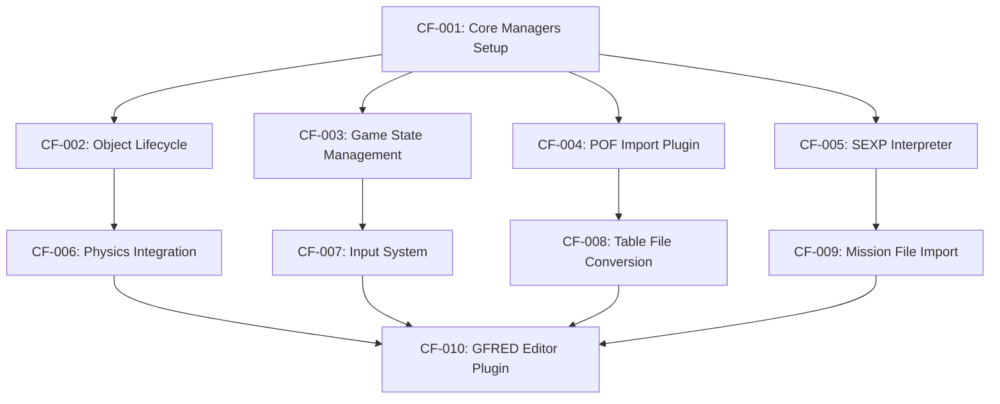

# Core Foundation Systems - Story Index

**Epic**: Core Foundation Systems  
**Created**: January 25, 2025  
**Story Manager**: SallySM  
**Status**: In Progress

## Epic Overview
Convert the foundational systems of Wing Commander Saga from C++ to Godot Engine, establishing the core infrastructure that all other game systems depend on.

## Story Dependencies Map

## Story List

### Phase 1: Core Infrastructure (Week 1-2)
| Story ID | Title | Status | Effort | Risk | Prerequisites |
|----------|-------|--------|--------|------|---------------|
| CF-001 | Core Manager Infrastructure Setup | Ready | 2-3 days | Low | None |
| CF-002 | Object Lifecycle Management System | Ready | 3 days | Medium | CF-001 |
| CF-003 | Game State Management System | Ready | 2-3 days | Low | CF-001 |

### Phase 2: Asset Pipeline (Week 2-3)
| Story ID | Title | Status | Effort | Risk | Prerequisites |
|----------|-------|--------|--------|------|---------------|
| CF-004 | POF Model Import Plugin | Ready | 3 days | High | CF-001 |
| CF-005 | SEXP Interpreter Core System | Ready | 3 days | High | CF-001 |
| CF-006 | Physics Integration System | Planned | 3 days | High | CF-002 |
| CF-007 | Input Processing System | Planned | 2-3 days | Low | CF-003 |

### Phase 3: Content Pipeline (Week 3-4)
| Story ID | Title | Status | Effort | Risk | Prerequisites |
|----------|-------|--------|--------|------|---------------|
| CF-008 | Table File Conversion System | Planned | 2 days | Medium | CF-004 |
| CF-009 | Mission File Import System | Planned | 3 days | High | CF-005 |
| CF-010 | Basic GFRED Editor Plugin | Planned | 3 days | High | CF-006,CF-007,CF-008,CF-009 |

### Future Phases (Week 4-6)
Additional stories will be created for:
- VP Archive extraction
- Animation file conversion
- Advanced GFRED features
- Performance optimization
- Integration testing

## Implementation Order
**CRITICAL**: Stories must be implemented in dependency order. No story can begin until all prerequisites are completed and approved.

### Week 1: Foundation
1. CF-001: Core Managers (2-3 days)
2. CF-002: Object Lifecycle (3 days) 
3. CF-003: Game State (2-3 days)

### Week 2: Core Systems
4. CF-004: POF Import (3 days) **[High Risk]**
5. CF-005: SEXP Interpreter (3 days) **[High Risk]**

### Week 3: Integration
6. CF-006: Physics Integration (3 days) **[High Risk]**
7. CF-007: Input System (2-3 days)

### Week 4: Content Pipeline
8. CF-008: Table Conversion (2 days)
9. CF-009: Mission Import (3 days) **[High Risk]**

### Week 5: Editor
10. CF-010: GFRED Plugin (3 days) **[High Risk]**

## Risk Analysis

### High Risk Stories (Require Special Attention)
- **CF-004**: POF model conversion - file format complexity
- **CF-005**: SEXP interpreter - performance requirements
- **CF-006**: Physics integration - preserving WCS feel
- **CF-009**: Mission import - complex data structures
- **CF-010**: GFRED editor - extensive UI requirements

### Mitigation Strategies
- Start high-risk stories early for more iteration time
- Have fallback plans for performance issues (C# alternatives)
- Extensive testing with real WCS content
- Community involvement for validation

## Quality Gates

### Before Story Approval
- [ ] All acceptance criteria are specific and testable
- [ ] Technical requirements reference approved architecture  
- [ ] Dependencies are correctly identified
- [ ] Story size is appropriate (1-3 days)
- [ ] Definition of Done is complete

### Before Implementation
- [ ] All prerequisite stories completed and approved
- [ ] Architecture document reviewed for relevant sections
- [ ] Test cases defined and understood
- [ ] Performance targets confirmed

### Before Story Completion
- [ ] All acceptance criteria verified
- [ ] Performance targets met
- [ ] Integration tests pass
- [ ] Code review completed
- [ ] Documentation updated

## BMAD Workflow Compliance

### Current Status: ✅ COMPLIANT
- [x] PRD approved (`.ai/docs/wcs-core-foundation-prd.md`)
- [x] Architecture approved (`.ai/docs/wcs-core-foundation-architecture.md`)
- [x] Stories created with proper dependencies
- [x] Quality gates defined and enforced

### Next Phase Requirements
- Implementation cannot begin until individual stories are approved
- Only one story should be in progress at a time
- All quality checklists must be run before story completion

---

**Story Manager**: SallySM  
**Last Updated**: January 25, 2025  
**Next Review**: After CF-001 completion