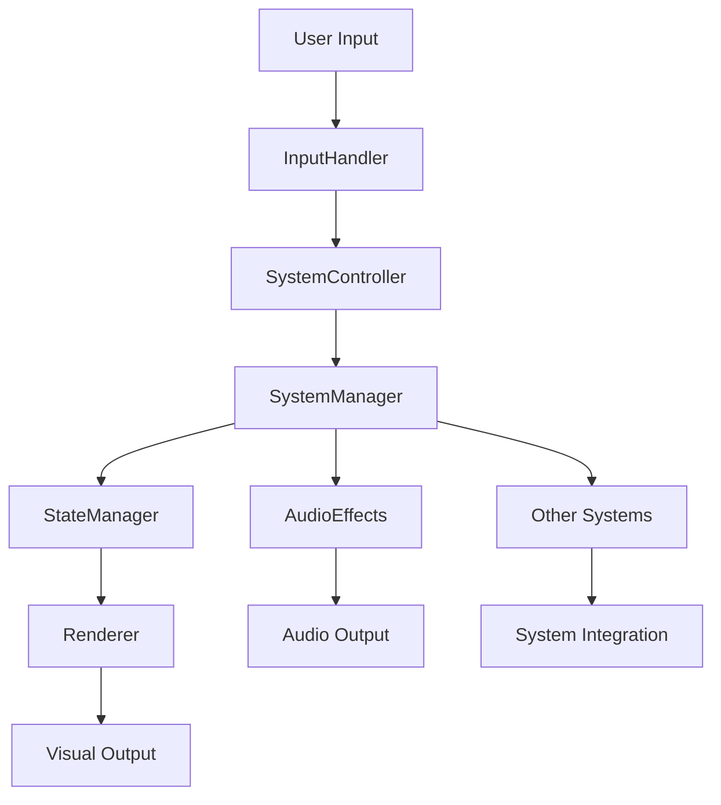

# Godot Architecture Document: [System Name]

**Document Version**: 1.0  
**Date**: [Date]  
**Architect**: Mo (Godot Architect)  
**System**: [WCS System Name]  
**Epic**: [Epic Name]  

## Executive Summary

### System Overview
**Purpose**: [Brief description of what this system does in WCS and its role in the game]

**Conversion Goals**: [Key goals for converting this system to Godot]

**Architecture Approach**: [High-level architectural approach and key design decisions]

### Key Design Decisions
- **[Decision 1]**: [Rationale and impact]
- **[Decision 2]**: [Rationale and impact]
- **[Decision 3]**: [Rationale and impact]

## WCS System Analysis Reference

### Original Implementation
**Analysis Document**: [Link to WCS system analysis in `bmad-artifacts/docs/[epic-name]/analysis.md`]

**Key C++ Components**:
- **[Component 1]**: [Description and role]
- **[Component 2]**: [Description and role]
- **[Component 3]**: [Description and role]

**Critical Algorithms**: [Key algorithms that must be preserved or adapted]

**Performance Characteristics**: [Current performance benchmarks and requirements]

### Conversion Requirements
**PRD Reference**: [Link to approved PRD in `bmad-artifacts/docs/[epic-name]/prd.md`]

**Must-Have Features**: [Core features that must be preserved]

**Enhanced Features**: [Improvements possible in Godot implementation]

**Performance Targets**: [Specific performance requirements for Godot version]

## Godot Architecture Design

### Scene Architecture

#### Main Scene Structure
```
[SystemName]Manager (Node)
├── [SystemName]Controller (Node)
│   ├── InputHandler (Node)
│   └── StateManager (Node)
├── [SystemName]Renderer (Node3D/Node2D)
│   ├── VisualEffects (Node)
│   └── AudioEffects (AudioStreamPlayer3D)
└── [SystemName]Data (Node)
    ├── ConfigurationManager (Node)
    └── ResourceManager (Node)
```

**Scene Rationale**: [Explanation of why this scene structure was chosen]

#### Component Scenes
- **[Component1].tscn**: [Purpose and composition]
- **[Component2].tscn**: [Purpose and composition]
- **[Component3].tscn**: [Purpose and composition]

### Node Architecture

#### Core Classes

##### [SystemName]Manager
```gdscript
class_name [SystemName]Manager
extends Node

## Main manager for [system description].
## Coordinates all [system] operations and maintains system state.

signal system_initialized()
signal system_state_changed(new_state: String)
signal system_error(error_message: String)

@export var auto_initialize: bool = true
@export var debug_mode: bool = false

var is_initialized: bool = false
var current_state: String = "idle"
```

**Responsibilities**:
- [Primary responsibility 1]
- [Primary responsibility 2]
- [Primary responsibility 3]

##### [SystemName]Controller
```gdscript
class_name [SystemName]Controller
extends Node

## Controls [system] behavior and handles user input/system events.

signal action_requested(action_type: String, parameters: Dictionary)
signal state_transition_requested(new_state: String)

@export var input_enabled: bool = true
@export var response_time: float = 0.1

var active_actions: Array[String] = []
```

**Responsibilities**:
- [Control responsibility 1]
- [Control responsibility 2]
- [Control responsibility 3]

##### [SystemName]Renderer
```gdscript
class_name [SystemName]Renderer
extends Node3D  # or Node2D for 2D systems

## Handles all visual rendering for [system].

signal render_complete()
signal visual_effect_finished(effect_name: String)

@export var quality_level: int = 2  # 0=Low, 1=Medium, 2=High
@export var enable_effects: bool = true

var render_queue: Array[RenderCommand] = []
```

**Responsibilities**:
- [Rendering responsibility 1]
- [Rendering responsibility 2]
- [Rendering responsibility 3]

### Signal Architecture

#### Signal Flow Diagram


#### Key Signals
- **system_initialized()**: [When and why emitted]
- **state_changed(new_state: String)**: [State transition notifications]
- **action_completed(action: String, result: Dictionary)**: [Action completion notifications]
- **error_occurred(error: Error)**: [Error handling and propagation]

### Data Architecture

#### Data Structures
```gdscript
class_name [SystemName]Data
extends Resource

## Core data structure for [system] configuration and state.

@export var system_config: [SystemName]Config
@export var runtime_data: [SystemName]RuntimeData
@export var performance_settings: [SystemName]PerformanceSettings

func validate_data() -> bool:
    # Validation logic
    return true
```

#### Configuration System
- **Static Configuration**: [Configuration that doesn't change during runtime]
- **Dynamic Configuration**: [Runtime-adjustable settings]
- **Performance Configuration**: [Performance-related settings]

#### State Management
- **Persistent State**: [State that survives scene changes]
- **Session State**: [State that lasts for the game session]
- **Transient State**: [Temporary state for immediate operations]

## Performance Architecture

### Performance Targets
- **Frame Rate Impact**: < [X] FPS impact on overall game performance
- **Memory Usage**: < [X] MB total memory footprint
- **Loading Time**: < [X] seconds for system initialization
- **CPU Usage**: < [X]% CPU usage during normal operation

### Optimization Strategies

#### CPU Optimization
- **Update Frequency**: [How often different components update]
- **Processing Distribution**: [How processing is distributed across frames]
- **Caching Strategy**: [What data is cached and when]

#### Memory Optimization
- **Resource Loading**: [When and how resources are loaded/unloaded]
- **Object Pooling**: [What objects are pooled for reuse]
- **Garbage Collection**: [Strategies to minimize GC impact]

#### GPU Optimization
- **Rendering Batching**: [How rendering calls are batched]
- **Shader Usage**: [Custom shaders and their purpose]
- **Texture Management**: [Texture loading and management strategy]

## Integration Architecture

### System Interfaces

#### Public API
```gdscript
# Main interface for other systems to interact with [SystemName]
class_name [SystemName]API
extends RefCounted

static func initialize_system(config: [SystemName]Config) -> bool
static func get_system_state() -> String
static func request_action(action: String, params: Dictionary) -> bool
static func shutdown_system() -> void
```

#### Event Interface
- **Incoming Events**: [Events this system listens for]
- **Outgoing Events**: [Events this system emits for other systems]
- **Event Priorities**: [Event handling priorities and order]

### Dependencies

#### Required Systems
- **[System1]**: [Why this dependency exists and how it's used]
- **[System2]**: [Why this dependency exists and how it's used]

#### Optional Systems
- **[OptionalSystem1]**: [Enhanced functionality when available]
- **[OptionalSystem2]**: [Enhanced functionality when available]

#### External Dependencies
- **Godot Engine Features**: [Specific Godot features required]
- **Third-party Assets**: [Any external assets or plugins needed]

## Implementation Guidance

### Development Phases

#### Phase 1: Core Framework
**Duration**: [Estimated time]
**Deliverables**:
- Basic scene structure
- Core classes with static typing
- Basic signal architecture
- Unit test framework

#### Phase 2: Core Functionality
**Duration**: [Estimated time]
**Deliverables**:
- Primary system functionality
- Integration with key dependencies
- Performance optimization
- Integration tests

#### Phase 3: Enhancement and Polish
**Duration**: [Estimated time]
**Deliverables**:
- Enhanced features
- Visual and audio polish
- Performance tuning
- Documentation completion

### Implementation Patterns

#### Initialization Pattern
```gdscript
func _ready() -> void:
    if auto_initialize:
        await initialize_system()

func initialize_system() -> void:
    _load_configuration()
    _setup_components()
    _connect_signals()
    _validate_system()
    is_initialized = true
    system_initialized.emit()
```

#### Error Handling Pattern
```gdscript
func handle_error(error: Error) -> void:
    push_error("System error: " + error.get_message())
    system_error.emit(error.get_message())
    
    if error.is_critical():
        _emergency_shutdown()
    else:
        _attempt_recovery()
```

#### Resource Management Pattern
```gdscript
func _load_resources() -> void:
    for resource_path in required_resources:
        var resource: Resource = load(resource_path)
        resource_cache[resource_path] = resource

func _cleanup_resources() -> void:
    for resource in resource_cache.values():
        if resource.has_method("cleanup"):
            resource.cleanup()
    resource_cache.clear()
```

## Testing Strategy

### Unit Testing
- **Test Coverage**: Minimum 80% coverage for all public methods
- **Test Framework**: GUT (Godot Unit Testing) framework
- **Mock Objects**: Mock external dependencies for isolated testing

### Integration Testing
- **System Integration**: Test integration with dependent systems
- **Performance Testing**: Validate performance targets under load
- **Stress Testing**: Test system behavior under extreme conditions

### Validation Testing
- **WCS Compatibility**: Validate behavior matches original WCS system
- **User Experience**: Validate that converted system feels authentic
- **Platform Testing**: Test on all target platforms

## Risk Assessment

### Technical Risks
- **[Risk 1]**: [Description, impact, and mitigation strategy]
- **[Risk 2]**: [Description, impact, and mitigation strategy]
- **[Risk 3]**: [Description, impact, and mitigation strategy]

### Performance Risks
- **[Performance Risk 1]**: [Description and mitigation]
- **[Performance Risk 2]**: [Description and mitigation]

### Integration Risks
- **[Integration Risk 1]**: [Description and mitigation]
- **[Integration Risk 2]**: [Description and mitigation]

## Future Considerations

### Extensibility
- **Planned Extensions**: [Future features that this architecture should support]
- **Modification Points**: [Areas designed for easy modification]
- **Plugin Support**: [How this system could support plugins or mods]

### Scalability
- **Performance Scaling**: [How system performance scales with load]
- **Feature Scaling**: [How easily new features can be added]
- **Platform Scaling**: [Considerations for additional platforms]

## Approval

### Architecture Review
- [ ] **Technical Soundness**: Architecture is technically feasible and robust
- [ ] **Godot Best Practices**: Follows established Godot patterns and conventions
- [ ] **Performance Viability**: Can meet all specified performance targets
- [ ] **Integration Compatibility**: Integrates properly with other systems
- [ ] **WCS Authenticity**: Preserves essential WCS gameplay feel

### Sign-off
**Architect**: _________________ **Date**: _________________
**Technical Review**: _________________ **Date**: _________________
**Project Manager**: _________________ **Date**: _________________

---

**Next Phase**: This approved architecture is ready for story creation and implementation planning.
